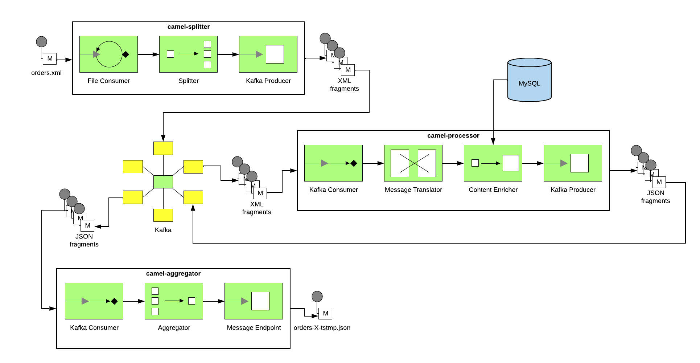

# camel-orders-demo



## Requirements

- [Apache Maven 3.x](http://maven.apache.org)
- [Red Hat AMQ Broker 7.x](https://developers.redhat.com/products/amq/overview)
- [MySQL 5.7.18](https://www.mysql.com/oem/)
  - [Docker Image](https://hub.docker.com/r/mysql/mysql-server/)

## Preparing

Install and run Red Hat AMQ Broker [https://developers.redhat.com/products/amq/hello-world]

- Broker configs for OpenShift can be found in the `kube/` directory.

Install and run MySQL [https://dev.mysql.com/doc/refman/5.7/en/installing.html]

_Note: For my tests, I chose to run the docker image [https://hub.docker.com/r/mysql/mysql-server/]. You can run it using the command `docker run --name mysql -e MYSQL_DATABASE=example -e MYSQL_ROOT_PASSWORD=Abcd1234 -e MYSQL_ROOT_HOST=172.17.0.1 -p 3306:3306 -d mysql/mysql-server:5.7`. You can then connect and run SQL statements using the command `docker exec -it mysql mysql -uroot -p`._

Build the project source code

```
cd $PROJECT_ROOT
mvn clean install
```

## Running the example standalone (should be done in 3 separate terminal windows/tabs)

```
cd $PROJECT_ROOT/camel-splitter
mvn spring-boot:run '-Dserver.port=8080' '-Dmanagement.port=8081'
cd $PROJECT_ROOT/camel-processor
mvn spring-boot:run '-Dserver.port=7070' '-Dmanagement.port=7071'
cd $PROJECT_ROOT/camel-aggregator
mvn spring-boot:run '-Dserver.port=9090' '-Dmanagement.port=9091'
```

## Running the example in OpenShift

```
oc new-project demo
cd $PROJECT_ROOT/camel-splitter
mvn -P openshift clean install fabric8:deploy
cd $PROJECT_ROOT/camel-processor
mvn -P openshift clean install fabric8:deploy
cd $PROJECT_ROOT/camel-aggregator
mvn -P openshift clean install fabric8:deploy
```

## Testing the code

_Note: If running on OpenShift, replace the URLs below with the OpenShift route._

To upload order data you can use `curl` (as seen below), or you can use the upload form at 'http://localhost:8080/upload.html'.

```
curl -X POST -F '@file=@./src/test/data/order-01.xml' 'http://localhost:8080/camel/files/'
```

To list the processed files you can use `curl` (as seen below), or you can use the files page at 'http://localhost:9090/files.html':

```
# To list all files
curl -X GET -H 'Accept: text/plain' 'http://localhost:9090/camel/files/'
# To see the contents of a file (replace the file name in the url)
curl -X GET -H 'Accept: application/json' 'http://localhost:9090/camel/files/orders-x-xxxxxxxxxx.json'
```
